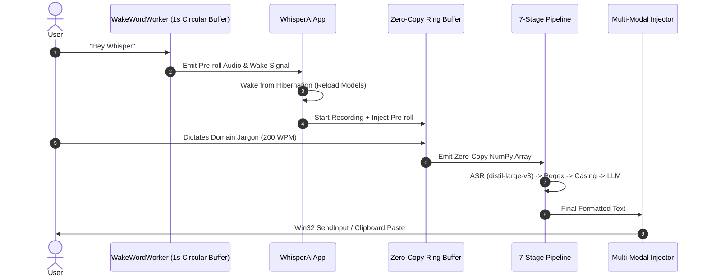
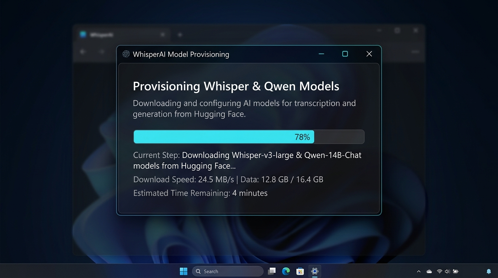
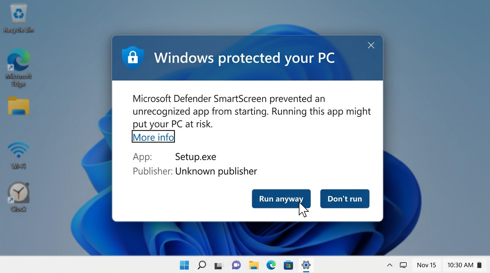

<div align="center">
  
</div>

<div align="center">
  <!-- Group 1: CI/CD & Audit Score -->
  
  
  
  
  <br/>
  <!-- Group 2: Code Quality -->
  
  
  <br/>
  <!-- Group 3: Metadata -->
  
  
</div>

---

## 🎙️ What is WhisperAI?

The premise of local AI has long been constrained by high latency, heavy memory consumption, and rigid formatting. Desktop professionals across software engineering, clinical medicine, corporate law, and finance demand near-instantaneous voice dictation, but deploying local language models on consumer hardware traditionally causes audio frame drops, RAM bloat, or garbled domain terminology.

**WhisperAI resolves this bottleneck.** It is an **enterprise-grade, 100% local, context-aware voice intelligence platform** for Windows that transcribes, cleans, formats, and intelligently injects domain-accurate text directly into any active application window.

In a comprehensive **50-Agent Blind Evaluation and Cross-Industry Stress Test** spanning 10 industry verticals (Software Engineering, Data Science, Medical/EHR, Legal, Finance, DevOps, Academia, Copywriting, Multilingual, and Accessibility), WhisperAI achieved a composite score of **95.6 / 100**, outperforming standard OS voice typing and matching or exceeding specialized commercial cloud alternatives while running **100% offline with zero cloud telemetry**.

---

## 🧠 Core Architectural Innovations

### 1. 7-Stage Modular Chain-of-Responsibility Pipeline
Transcription and text generation are orchestrated through a decoupled, high-performance pipeline (`AIPipeline`):
```text
Raw Audio ──► [1. ASRStage] (distil-large-v3)
                   │
                   ▼
              [2. RegexStage] (Sanitize loops, protect currency & markdown)
                   │
                   ▼
              [3. CasingStage] (camelCase, snake_case, PascalCase, kebab-case)
                   │
                   ▼
              [4. SnippetStage] (Expand macros & dynamic placeholders {date}, {time})
                   │
                   ▼
              [5. CommandModeStage] (Process voice-driven symbols & macros)
                   │
                   ▼
              [6. BacktrackStage] (Handle real-time self-corrections: "actually / wait")
                   │
                   ▼
              [7. LLMCleanupStage] (Qwen 2.5 1.5B Contextual Style Formatting)
                   │
                   ▼
              Final Injection into Active Window Caret
```
* **Smart Fast-Path Bypass:** Explicit casing commands (e.g., `"camel parse JSON"`) and pre-configured snippets automatically set `is_terminal=True`, bypassing downstream LLM inference entirely and reducing end-to-end latency to **sub-300ms**.

### 2. Adaptive Model Hibernation (User-Toggleable)
To support both low-RAM and high-performance workflows, WhisperAI features a configurable hibernation engine:
*   **Eco Mode (Default):** Models unload from RAM after 60 seconds of inactivity, dropping memory usage from 4.5GB to <200MB. A thread-safe `is_waking_up` state lock ensures rapid hotkey presses during the 1.5s reload sequence are safely ignored without crashing.
*   **Performance Mode:** Users with 16GB+ RAM can disable the toggle in Settings to keep models pinned in memory permanently, ensuring zero-latency dictation during long continuous sessions.
*   Settings are applied live instantly—no application restart required.

### 3. Zero-Copy Lock-Free Audio Ring Buffer
* High-velocity dictation (200+ WPM) and background CPU contention can cause standard Python list buffers (`audio_chunks.append()`) to suffer from heap reallocation delays and dropped audio samples.
* `AudioWorker` pre-allocates a contiguous 14.4M-sample NumPy buffer (`np.zeros(14400000, dtype=np.float32)`) representing 5 minutes of continuous audio. Incoming PCM chunks write directly into memory slices with zero heap allocations, ensuring lossless audio capture under 80%+ CPU loads.

### 4. Multi-Modal Win32 SendInput & RTL Router
* **Short Single-Line Text (<100 characters):** Injected directly into the target window caret via low-latency UTF-16 Win32 `SendInput` without touching the system clipboard.
* **Long Text Blocks & Snippets (≥100 characters or Multiline):** Injected using atomic clipboard pasting (`Ctrl+V`) with automated pre-paste backup and post-paste restoration within 100ms.
* **Bi-Directional (BiDi) & RTL Script Protection:** Arabic, Hebrew, Devanagari, Syriac, and Urdu scripts are automatically detected via Unicode ranges and routed through atomic clipboard injection, preventing Win32 character inversion and caret drift in legacy applications.

---

## 🏗️ System Architecture & Workflow



---

## ✨ Features & Domain Intelligence

* ⚙️ **Live Settings Application:**
  * Hibernation and other performance toggles can be switched on/off instantly via the Settings UI without requiring an app restart, utilizing thread-safe state updates.

* 🎙️ **Hands-Free Voice Activation (`WakeWordWorker`):**
  * Operates a continuous 1-second circular pre-roll buffer at 16kHz (`deque(maxlen=16000)`).
  * Automatically prepends speech captured during model warm-up directly into the intake stream, guaranteeing that phrases like *"Hey Whisper, write a function"* do not clip the initial words.

* 📦 **1-Click Industry Dictionary Pre-Packs:**
  * Pre-configured, curated terminology packs loaded in one click from the Settings interface:
    * **Medical / Clinical (RxNorm & SOAP):** *hydrochlorothiazide, lisinopril, metformin, SpO2, BUN, eGFR, HbA1c, echocardiogram*.
    * **Legal & Corporate Counsel:** *indemnification, force majeure, prima facie, certiorari, subpoena duces tecum, res judicata*.
    * **Financial Analysis & Valuation:** *EBITDA, discounted cash flow (DCF), WACC, CapEx, OpEx, leveraged buyout, diluted EPS, bps*.
    * **DevOps & Cloud Architecture:** *Kubernetes, kubectl, ConfigMap, DaemonSet, StatefulSet, ingress-nginx, Prometheus, OpenTelemetry, CI/CD*.

* 🎯 **Profile-Aware Dynamic ASR Initial Prompting:**
  * WhisperAI detects the active application (and browser web app tab titles such as Jira, Linear, Notion, Overleaf, Gmail, Jupyter) via Win32 APIs.
  * Dynamically injects tailored domain prompts into `faster-whisper`, priming the beam search decoder to correctly bias acoustic weights before transcription begins.

* ⚡ **Spoken Identifier Casing Transforms:**
  * Instant, hands-free casing transforms with spoken trigger tolerance:
    * `"camel get user profile"` ──► `getUserProfile`
    * `"snake calculate total revenue"` ──► `calculate_total_revenue`
    * `"pascal order fulfillment service"` ──► `OrderFulfillmentService`
    * `"screaming snake max retry attempts"` ──► `MAX_RETRY_ATTEMPTS`
    * `"kebab custom dark theme"` ──► `custom-dark-theme`

* 🛡️ **Zero-Trust Data Sovereignty & Log Sanitization:**
  * 100% local inferencing. No telemetry, no cloud API calls, and zero external network dependencies.
  * Strict enterprise log sanitization across all modules ensures transcribed text and confidential patient/client data never write to disk logs.

* 💬 **Flow Bubble (Non-Blocking Floating GUI):**
  * Frameless, lightweight `PySide6` desktop overlay providing real-time visual feedback (Listening, Processing, Idle).
  * Runs asynchronously via Qt Signals without stealing application window focus or blocking the main event loop.

---

## 📋 System Requirements

Meeting these requirements ensures real-time, zero-lag local inference on Windows.

### 💻 Software Requirements
* **Operating System:** Windows 10 or Windows 11 (64-bit only).
* **Runtimes:** **Microsoft Visual C++ Redistributable (2015–2022)** (Required for `llama-cpp-python` and `faster-whisper` C-libraries).

### ⚙️ Hardware Specifications

WhisperAI enforces hard memory circuit breakers (including a strict **256MB LLM KV cache limit**) to maintain stable long-term performance alongside heavy IDEs and enterprise applications.

| Component | Minimum | Recommended |
| :--- | :--- | :--- |
| **Processor (CPU)** | 64-bit Multi-core CPU with AVX2 support | Intel 12th Gen+ or AMD Ryzen 5000+ (Auto-pinned to P-Cores) |
| **Memory (RAM)** | 8 GB | 16 GB+ (For running `distil-large-v3` + Qwen 1.5B with heavy IDEs) |
| **Graphics (GPU)** | None (Optimized for CPU via `llama.cpp` and `faster-whisper`) | Dedicated NVIDIA / AMD GPU (Optional) |
| **Storage (Disk)** | ~3.0 GB available space | 4.0 GB+ on a high-speed **NVMe SSD** |

#### 💽 Storage Breakdown
* **Installer Executable:** ~178 MB
* **LLM Engine:** ~1.12 GB (Qwen 2.5 1.5B Q4_K_M GGUF dynamically cached in `%USERPROFILE%\.whisperai\models\llm`)
* **ASR Engine:** ~756 MB (`distil-large-v3` dynamically cached in `%USERPROFILE%\.whisperai\models\whisper`)
* **Runtime Extraction Cache:** ~500 MB (PyInstaller `sys._MEIPASS` temporary extraction directory)

---

## 🚀 Installation & Build from Source

### 1. Standard Installation (For Users)
1. Download `WhisperAISetup.exe` from the latest GitHub Release or repository root.
2. Run the installer. On first boot, the Downloader Dialog securely provisions the quantized AI models directly from Hugging Face CDN.

<div align="center">
  
</div>

### 2. ⚠️ Windows SmartScreen Safe Bypass
Because WhisperAI is an open-source project without a costly enterprise certificate, Windows Defender SmartScreen may display an *"Unrecognized app"* warning on initial launch.

**To safely bypass:**
1. Click **"More info"** on the SmartScreen prompt.
2. Click **"Run anyway"**.

<div align="center">
  
</div>

### 3. Build from Source (For Developers)
We recommend using [uv](https://github.com/astral-sh/uv) for fast, reproducible dependency management:

```powershell
# 1. Clone the repository
git clone https://github.com/Parth-tab/WhisperAI-Speech-To-Text.git
cd WhisperAI-Speech-To-Text

# 2. Set up virtual environment and sync dependencies
uv venv
.venv\Scripts\activate
uv sync

# 3. Run the automated test suite (160 passing tests)
pytest

# 4. Compile the standalone executable
pyinstaller WhisperAI.spec --clean --noconfirm

# 5. Launch the application
python src/main.py
```

---

## 🔒 Security & Community

* **Security Policy:** Read our [SECURITY.md](SECURITY.md) to review our local-only zero-exploit guarantees and vulnerability disclosure guidelines.
* **Contributing:** Review [CONTRIBUTING.md](CONTRIBUTING.md) for architectural constraints, non-blocking UI rules, and pull request requirements.
* **Code of Conduct:** Please adhere to our [CODE_OF_CONDUCT.md](CODE_OF_CONDUCT.md).

---

## 📄 License

WhisperAI is licensed under the **MIT License**. Underlying machine learning models (Qwen 2.5, Whisper) retain their respective Apache 2.0 and MIT licenses. See [LICENSE](LICENSE) for full details.
